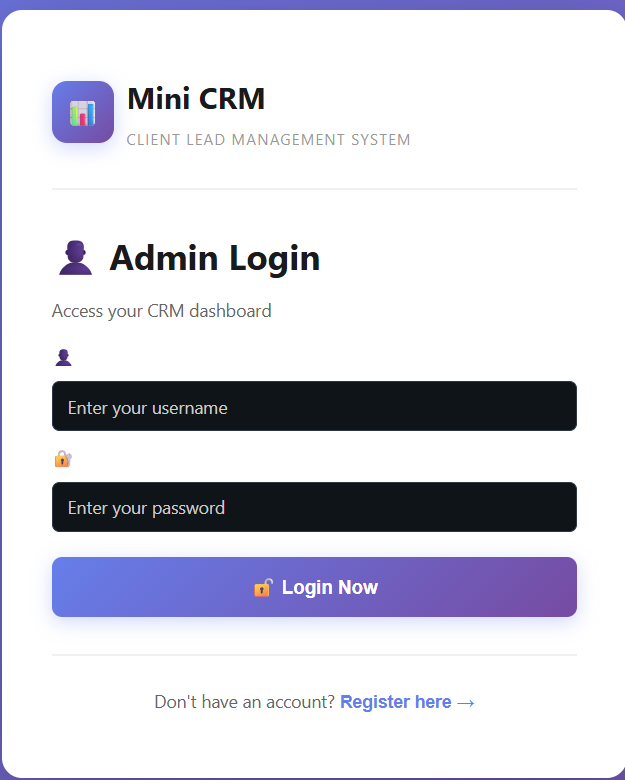
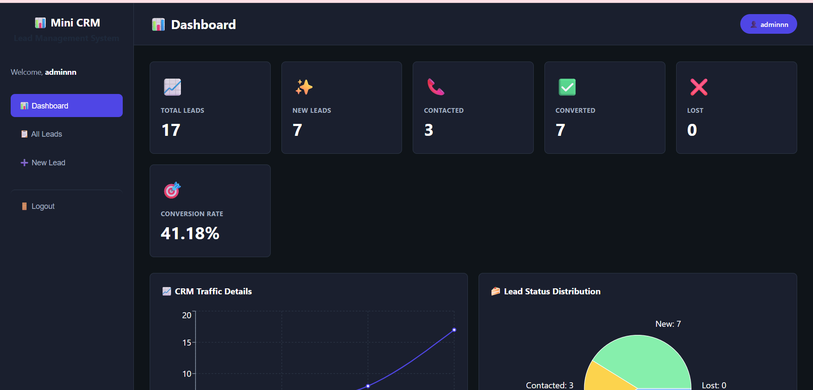
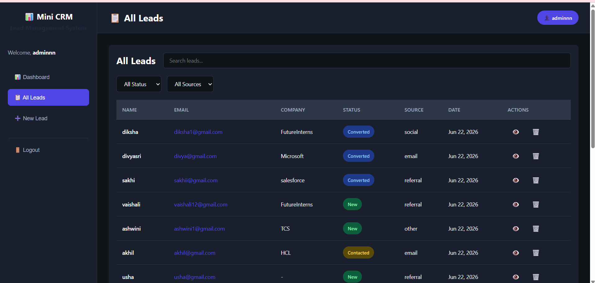

# 🚀 Mini CRM - Client Lead Management System

## 📖 Overview
Mini CRM is a full-stack Client Lead Management System developed to help businesses, agencies, and freelancers efficiently manage incoming leads, track their progress, add follow-up notes, and convert prospects into clients. The application provides a secure and user-friendly dashboard for managing customer relationships.

# Login page


## 📌 Features
* 👥 Add and manage client leads
* 📋 View all leads in a centralized dashboard
* 🔄 Update lead status (New → Contacted → Converted)
* 📝 Add follow-up notes for each lead
* 🔐 Secure admin authentication
* 🔍 Search and filter leads
* 📊 Track lead conversions
* ⚡ Real-time lead management
* 📱 Responsive and user-friendly interface
## 📸 Application Preview


## 🛠️ Technologies Used
### Frontend
* React.js
* HTML5
* CSS3
* JavaScript
* Axios
### Backend
* Node.js
* Express.js
### Database
* MongoDB
* Mongoose
### Authentication
* JWT (JSON Web Token)
* bcryptjs

## 📂 Project Structure
```text
mini-crm/
│
├── backend/
│   ├── config/
│   ├── controllers/
│   ├── middleware/
│   ├── models/
│   ├── routes/
│   ├── server.js
│   └── .env
│
├── frontend/
│   ├── src/
│   │   ├── components/
│   │   ├── pages/
│   │   ├── App.jsx
│   │   └── main.jsx
│   └── package.json
│
└── README.md
```
## 💡 About the Project

This Mini CRM system was built to simulate a real-world client management platform used by businesses to:

* Store customer leads
* Track communication status
* Manage follow-up activities
* Monitor lead conversions
* Improve customer relationship management


## 🎯 Objectives
* Build a real-world full-stack application
* Learn REST API development
* Practice MongoDB database operations
* Implement secure authentication
* Manage and track customer leads efficiently
## 📚 Learning Outcomes
* MERN Stack Development
* REST API Design
* MongoDB & Mongoose
* Authentication using JWT
* CRUD Operations
* State Management
* Responsive UI Development

## ▶️ How to Run
### Clone the repository
```bash
git clone https://github.com/your-username/mini-crm.git
cd mini-crm
```
### Backend Setup
```bash
cd backend
npm install
npm run dev
```
### Frontend Setup
```bash
cd frontend
npm install
npm run dev
```
### Create .env File
```env
PORT=5000
MONGO_URI=your_mongodb_connection_string
JWT_SECRET=your_secret_key
```
## 👩‍💻 Author
**Jangili Sandhya**
* 🎓 B.Tech Computer Science Student
* 🐍 Python Developer
* 🌐 Full Stack Developer
* 🤖 AI/ML Enthusiast

### Connect With Me
* LinkedIn: [www.linkedin.com/in/jangili-sandhya](http://www.linkedin.com/in/jangili-sandhya)
* GitHub: [github.com/jangilisandhya](https://github.com/jangilisandhya)

⭐ Thank you for visiting my Mini CRM project repository!
